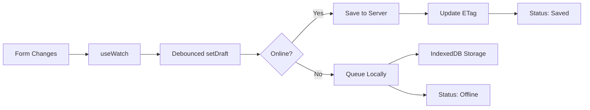

# Autosave & Sync Documentation

## Overview

The Feasly Model v2 autosave system provides robust offline-first form persistence with conflict resolution. It automatically saves draft changes locally and syncs with the server when online.

## Architecture

### Core Components

- **`useAutosaveSync`** - Main hook managing state, persistence, and sync logic
- **`FeaslyModelAPI`** - API adapter handling HTTP requests and data transformation
- **`SaveIndicator`** - UI component showing current sync status
- **`ConflictModal`** - UI for resolving merge conflicts
- **`AutosaveContext`** - React context for sharing autosave state

### Data Flow



## API Contract

### Draft Save Endpoint
```
PATCH /api/models/{modelId}/draft
Content-Type: application/json
If-Match: {etag}

Response:
200 OK - { etag: "new-etag" }
409 Conflict - { serverData: {...}, etag: "server-etag" }
```

### Commit Endpoint
```
POST /api/models/{modelId}
Content-Type: application/json
If-Match: {etag}

Response:
200 OK - { etag: "new-etag", version: 2 }
409 Conflict - { serverData: {...}, etag: "server-etag" }
```

## Offline Queue

### Queue Structure
```typescript
interface QueuedSave {
  id: string;
  modelId: string;
  data: any;
  etag?: string;
  timestamp: number;
  retryCount: number;
  type: 'draft' | 'commit';
}
```

### Retry Logic
- **Exponential backoff**: 2^retryCount * 1000ms
- **Max retries**: 5 attempts
- **Queue size**: 20 items (FIFO with overflow protection)

### Storage Keys
- `feasly.autosave.{modelId}` - Current draft data
- `feasly.queue.{modelId}` - Queued save operations
- `feasly.etag.{modelId}` - Current ETag for conflict detection

## Conflict Resolution

### Detection
Conflicts are detected via HTTP 409 responses when ETags don't match.

### Resolution Strategies

1. **Overwrite** - Force save local changes, discarding server changes
2. **Merge** - Combine server and local data (last-write-wins for conflicts)
3. **Cancel** - Discard local changes, revert to server version

### Conflict Modal Flow
1. User attempts to save/commit
2. Server returns 409 with conflict data
3. ConflictModal displays differences
4. User selects resolution strategy
5. System applies resolution and retries

## Usage Examples

### Basic Integration
```tsx
function FeaslyModelV2({ projectId, onSubmit }) {
  const autosave = useAutosaveSync(projectId);
  const form = useForm();
  
  const watchedValues = useWatch({ control: form.control });
  useDebounce(watchedValues, 1000, autosave.setDraft);
  
  const handleSubmit = async (data) => {
    try {
      await autosave.commit(data);
      await onSubmit(data);
    } catch (error) {
      if (error.name === 'ConflictError') {
        setConflict(error);
      }
    }
  };
  
  return (
    <AutosaveContext.Provider value={autosave}>
      <SaveIndicator state={autosave.state} />
      <form onSubmit={handleSubmit}>
        {/* form fields */}
      </form>
    </AutosaveContext.Provider>
  );
}
```

### Manual Queue Processing
```tsx
const { processQueue } = useAutosaveContext();

// Process queue on connectivity restore
useEffect(() => {
  const handleOnline = () => processQueue();
  window.addEventListener('online', handleOnline);
  return () => window.removeEventListener('online', handleOnline);
}, [processQueue]);
```

## Status Indicators

### SaveIndicator States
- **Idle** - No pending changes
- **Saving** - Actively syncing with server
- **Saved** - Successfully synced
- **Error** - Sync failed (with retry)
- **Offline** - Queued for later sync

### ARIA Accessibility
- `aria-live="polite"` for status updates
- Descriptive labels for screen readers
- Keyboard navigation support

## Performance Considerations

### Debouncing
- **Idle delay**: 1000ms between typing and save
- **Autosave interval**: 5000ms for periodic saves
- Form change detection via `useWatch`

### Memory Management
- Automatic cleanup on component unmount
- Queue size limits prevent memory bloat
- ETag caching reduces redundant requests

### Storage Persistence
- Calls `navigator.storage.persist()` for reduced eviction risk
- Uses IndexedDB for structured data storage
- Graceful fallback if storage unavailable

## Testing Strategy

### Unit Tests
- Offline save queueing
- Queue processing and retry logic
- Conflict detection and resolution
- Data persistence and recovery

### E2E Tests
- Network offline/online scenarios
- Multi-tab conflict resolution
- Browser restart with draft recovery
- Queue overflow handling

## Troubleshooting

### Common Issues

**Queue not processing**
- Check network connectivity
- Verify API endpoints are reachable
- Review retry count and backoff timing

**Conflicts not resolving**
- Ensure ETags are properly returned from API
- Check conflict modal UI state
- Verify resolution handlers are wired correctly

**Data loss on refresh**
- Confirm IndexedDB storage permissions
- Check for quota exceeded errors
- Verify persistence API support

### Debug Logging
Enable detailed logging with:
```javascript
localStorage.setItem('debug', 'feasly:autosave');
```

## Migration Guide

### From v1 to v2
1. Replace manual save calls with `useAutosaveSync`
2. Add conflict resolution UI components
3. Update API endpoints to support ETags
4. Test offline scenarios thoroughly

### Breaking Changes
- Form submission now async (returns Promise)
- Save indicators require new status enum
- Conflict resolution is now mandatory for production use